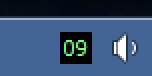
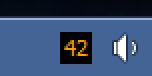
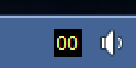
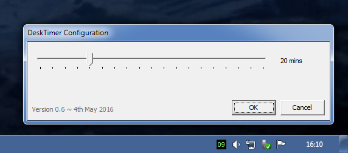

# DeskTimer

A relic from the Visual Basic days, a simple Windows app that shows a countdown timer in the notification area (aka "system tray"). I wrote this many years ago to remind me not to sit still too long when I got engrossed in work, and it still works!

It counts down minutes in green,

then seconds in orange,

then flashes an annoying yellow 00 until you click to reset it.

Right-clicking accesses a simple configuration window to change the countdown period, and an 'Exit' option.

## Running It

The executable is in the `dist` folder. You'll probably need `msvbvm60.dll` and `comctl32.ocx` installed, but that's between you and Microsoft.

## Known Issues

- The program assumes that the Tahoma font is available.
- If the system DPI setting is non-default, digits may be drawn at the wrong size.
- Could do with rewriting in something a bit more modern!

## License

Code is copyright by Tyrone C. and made available under the MIT license, the text of which can be found in the `LICENSE.md` file in this repository, though why anyone really wants a trivial VB6 app from the 1990s I know not.
